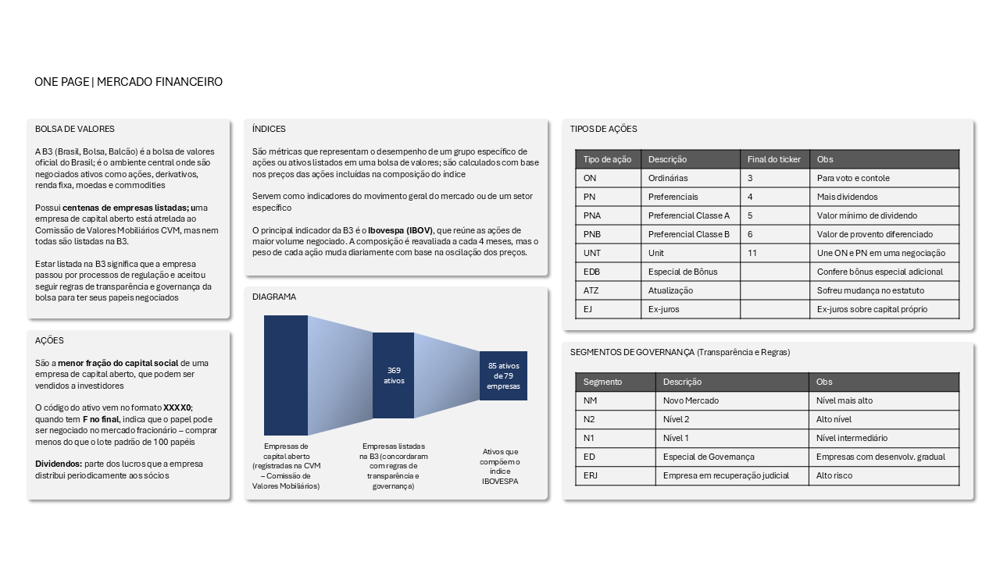
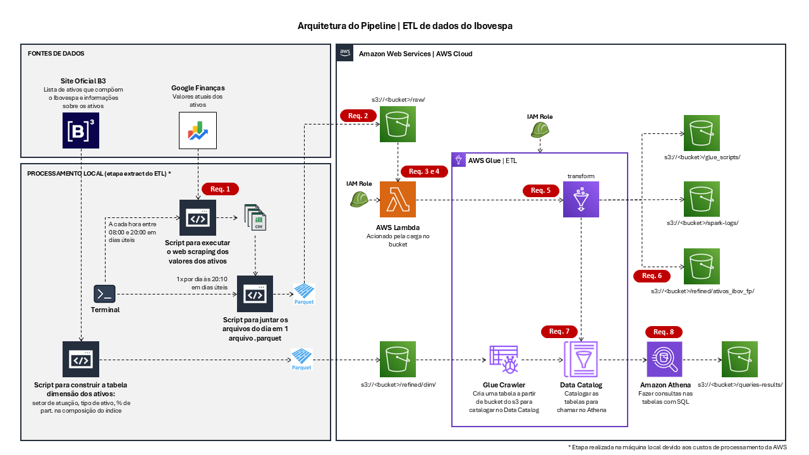
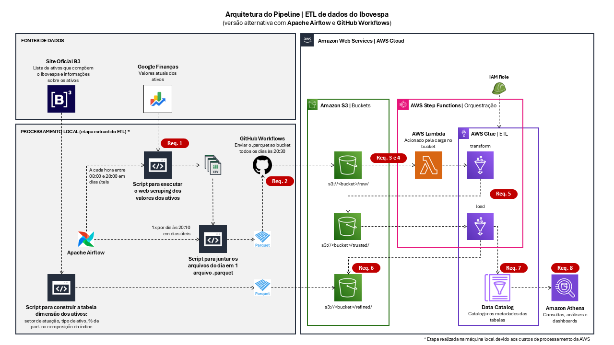
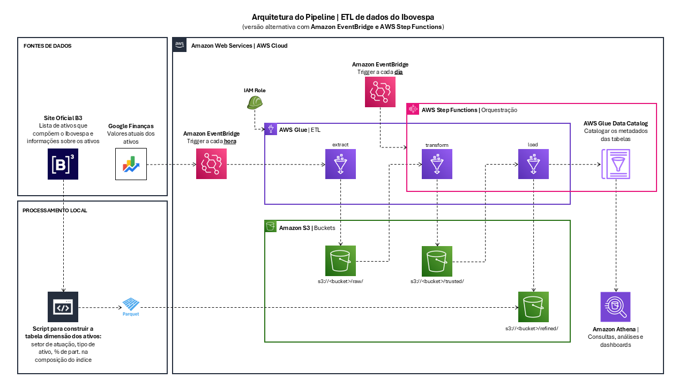

# Pipeline ETL Batch | Ibovespa
*Tech Challenge da Fase 2 do curso de [pós-graduação em Engenharia de Machine Learning FIAP](https://postech.fiap.com.br/curso/machine-learning-engineering/)*

> 📽️ Vídeo com demonstração técnica do projeto - Em breve

## 🎯 Sobre o projeto
*O objetivo do projeto é construir um pipeline completo de dados para **extrair, processar, carregar e analisar** dados das ações que compõem o índice Ibovespa no momento de construção do projeto (março/2026).*

> ### AWS
O projeto foi provisionado utilizando os serviços do ecossistema da [Amazon Web Services - AWS](https://aws.amazon.com/pt/):
- **Amazon S3:** Data Lake que contém os buckets para armazenar os dados nas camadas raw e refined
- **AWS Glue:** Para construir a ETL (extração dos dados, transformações para consistência e carregamento na camada refined) - automatiza o processo de preparação e combinação dos dados
- **AWS Lambda:** Acionado pela carga no bucket do S3, chama o job de ETL no Glue
- **AWS Glue Data Catalog**: Para catalogar os dados processados
- **Amazon Athena:** Para analisar os dados processados

> ### Terraform

O [Terraform](https://developer.hashicorp.com/terraform) é uma ferramenta de **IaC (Infraesturura como Código)**, que permite provisionar recursos de um pipeline de ETL em uma cloud, nesse caso, na AWS.<br>Ele permite construir todo o processo de ETL na forma de código, desde o scraping até a disponibilização dos dados.

Algumas vantagens do uso do Terraform:
- Permite documentação do processo
- Evita que as etapas executadas na AWS (caso fossem realizadas de forma low code, "arrastando caixinhas" ou preenchendo os campos dos formulários) sejam perdidas - evita retrabalhos
- Garante reprodutibilidade e melhoria contínua (possibilita refatoração do código e adição de novas funcionalidades)

> ### Conceitos | Mercado Financeiro
Uma etapa importante do projeto é o entendimento dos conceitos relacionados ao Mercado Financeiro. Isso permite que a disponibilização dos dados será feita de forma a atender as possíveis análises que utilizarão os dados disponibilizados. Abaixo, há um One Page que resume os principais conceitos:



> ### Tabelas a serem ingestadas no processo de ETL

Sabendo destes conceitos, temos a necessidade dos seguintes dados, disponibilizados pelas seguintes tabelas (que se relacionam a partir do Ticker (código) da ação):
- **Dimensão (características):** Tabela com as características de cada ação (nome da empresa, setor de atuação, tipo de ação, segmento da ação, % de participação na composição do índice). Fontes de dados:
  - A lista atualizada de ativos do Ibovespa (que no projeto foi acessada em 08/03/2026) está disponível [neste link](https://www.b3.com.br/pt_br/market-data-e-indices/indices/indices-amplos/indice-ibovespa-ibovespa-composicao-da-carteira.htm). A ideia será acompanhar os valores das ações que estão nesta lista.
  - A tabela de todas as empresas listadas na B3 com seus respectivos setores está disponível [neste link](https://www.b3.com.br/pt_br/produtos-e-servicos/negociacao/renda-variavel/empresas-listadas.htm), opção "Busca por Setor de Atuação". Essa tabela será usada para enriquecer a tabela dimensão da lista de ativos que compõem o Ibovespa.

- **Fato (eventos):** Tabela com os valores das ações que compõem o índice Ibovespa a cada hora do período analisado. Os dados serão obtidos a partir do site do [Google Finance](https://www.google.com/finance/).

## ⚙️ Funcionalidades

- Processamento da tabela dimensão com as características dos ativos do Ibovespa (etapa executada na máquina local)
- **[Extract]** Web Scraping dos dados do Ibovespa (etapa executada na máquina local para evitar custos de processamento por hora na AWS)
- Criação de IAM Roles 
  - IAM Role para execução dos processos no **AWS Glue**
  - IAM Role para execução dos processos no **AWS Lambda**
- **[Transform e Load]** Transformação e carregamento dos dados executada com **AWS Glue**
  - Renomear colunas
  - Criação de colunas auxiliares: dia da semana, abertura e fechamento do dia
  - Agrupamento e sumarização: contagem, min, max, média, mediana e desvio padrão por ação e dia
  - Cálculo do ganho ou perda % do dia
  - Valores mínimos e máximos da semana
- Criação da tabela dimensão dos ativos com **Glue Crawler** para catalogar no **AWS Glue Data Catalog**
- Catalogação dos dados no **AWS Glue Data Catalog**
- Análise dos dados no **Amazon Athena**

## 📐 Arquitetura

*Obs.: As tags em vermelho são referentes aos 8 requisitos exigidos para completar o Tech Challenge*



## 📂 Estrutura do projeto
```
terraform-aws-stock-etl/
├── diagrams/
│   ├── arquitetura.png
│   ├── arquitetura_alt_airflow.png
│   ├── arquitetura_alt_eventbridge.png
│   └── one_page_bolsa.png
├── extract_local/
│   ├── data/
│   │   ├── daily/ (tabelas .parquet diárias)
│   │   ├── raw/ (tabelas brutas para criar a tabela dimensão)
│   │   ├── refined/ (tabela dimensão pronta)
│   │   └── scraped/ (dados extraídos por hora)
│   └── src/
│       ├── __init__.py
│       ├── daily_concat_scraped_data.py
│       ├── process_dimension_table.py
│       └── web_scraping.py
├── infra_aws/
│   ├── s3/
│   │   └── main.tf
│   ├── iam/
│   │   └── main.tf
│   ├── glue/
│   │   ├── glue-job-transform.py
│   │   ├── main.tf
│   │   └── variables.tf
│   ├── lambda/
│   │   ├── variables.tf
│   │   └── lambda_function.py
│   ├── athena/
│   │   ├── queries_dim.sql
│   │   ├── queries_fp.sql
│   │   └── join_dim_fp.sql
│   └── prod/
│       └── providers.tf
├── .gitignore
├── README.md
└── requirements.txt
```

## ✅ Etapas de execução
⚠️ ***Observações:***
- *A ideia inicial era montar todo o projeto em Terraform, mas devido a imprevistos durante a execução, o prazo ficou apertado e as etapas de provisionamento dos serviços da AWS precisaram ser executadas manualmente.<br>Os arquivos HCL (HashiCorp Configuration Language, com a extensão `.tf`) que já tinham sido escritos foram mantidos para documentação, mas na prática não foram executados.*
- *Todos os serviços da AWS foram criados na Região us-east-1*

### 1. [Local] Processamento da tabela dimensão
- Download das tabelas disponíveis nos links da seção [Tabelas a serem ingestadas](#tabelas-a-serem-ingestadas-no-processo-de-etl)
  - Tabelas com os ativos no momento do projeto disponíveis em `extract_local/data/raw/`
- Pré-processamento e join para gerar a tabela dimensão
  - Módulo `extract_local/src/process_dimension_table.py`
  - Persiste tabela em `extract_local/data/refined/ativos_ibov.parquet`

### 2. [Local] Web scraping dos valores das ações
- Função para executar o scraping dos valores das ações → `extract_local/src/web_scraping.py`
- Dados por hora são persistidos em formato .csv em `extract_local/data/scraped/` (não sobe para repositório)
- Executar o script `extract_local/src/web_scraping.py` todos os dias úteis pela manhã (8:00) e interromper a execução à noite (20:00) para pegar os valores de abertura e fechamento do dia
- Executar o script `extract_local/src/daily_concat_scraped_data.py` após a interrupção da execução para concatenar os arquivos .csv do dia em um arquivo .parquet
- Upload manual da tabela .parquet no bucket S3

### 3. [Amazon S3] Criação do Bucket e estrutura de pastas
- No console da AWS, procurar por "S3"
- Ir no botão laranja "Criar bucket"
- Tipo de bucket "Propósito geral", Bucket namespace "Global namespace"
- Definição do nome do bucket "teste-ibov-etl-<id_conta>
- Demais configurações mantidas no default, clicar em "Criar bucket"
- Dentro do bucket, foram criadas as pastas especificadas no arquivo `infra_aws/s3/main.tf`
- Dentro da pasta `refined/`, foram criadas as subpastas:
  - `dim/` (para persistir a tabela dimensão)
  - `ativos_ibov_fp/` (para apontar a persistência das tabelas fato processadas)

### 4. [AWS IAM] Criação das Roles para permissões do Glue e do Lambda
- Entrar em IAM → Roles → Create role
- IAM Role para **Glue**
  - Etapa 1: Serviço da AWS, Use case: Glue
  - Etapa 2: Selecionar permissões: AWSGlueServiceRole, AmazonS3FullAccess, CloudWatchLogsFullAccess
  - Etapa 3: Nome `role-glue-etl-ibov` (ou `AWSGlueServiceRole-ibov-etl` para ficar no padrão de nomes)
  - Create role
- IAM Role para **Lambda**
  - Etapa 1: Serviço da AWS, Use case: Lambda
  - Etapa 2:
    - Selecionar permissões: AWSLambdaBasicExecutionRole, AWSGlueConsoleFullAccess
    - Criar política com código, como está no arquivo `infra_aws/iam/main.tf`
  - Etapa 3: Nome `role-lambda-function`
  - Create role

### 5. [AWS Lambda] Aciona a execução do job Glue ao upload de arquivo no bucket S3

- Entrar em Lambda → Funções → Criar função
- Criar do zero, dar um nome à função (no projeto, foi usado `call-glue-job-transform`)
- Em "alterar a função de execução padrão", ir em usar outro perfil e escolher a IAM Role criada para a função Lambda e criar a função
- Configuração do código - script disponível em `infra_aws/lambda/lambda_function.py`
- No bucket criado no S3:
  - ir em "Propriedades"
  - criar notificações de eventos
  - colocar prefixo "raw/" e sufixo ".parquet"
  - marcar "Todos os eventos de criação de objeto"
  - colocar como destino a função do lambda criada
- Voltar para a função Lambda, ir em Configuração → variáveis de ambiente
  - definir RAW_PATH e REFINED_PATH (URI das respectivas pastas do bucket S3 - s3://<bucket>/pasta/)
- Na parte do código, clicar em "Deploy" no menu esquerdo
- OS logs de execução poderão ser vistos no **Amazon CloudWatch**

### 6. [AWS Glue] Transformação e carregamento dos dados

- No console da AWS, procurar por "Glue"
- No menu esquerdo, ir em Databases → Criar database → nome usado foi `db_refined`
- No menu esquerdo do Glue, ir em Crawlers → Create Crawler → criar o `crawler-tabela-dim-ativos-ibov` para subir a **tabela dimensão** para o Data Catalog
  - apontar para a pasta refined/ativos_ibov_dim/ do bucket (na pasta apontada não pode ter nada além da tabela)
  - selecionar a IAM Role criada para o Glue
  - selecionar a database db_refined e criar o crawler
  - após criado, o crawler precisa ser executado para jogar a tabela na database e aparecer no Athena
- Repetir o processo de criação do crawler para a **tabela fato** (que vai receber as transformações do Glue)
- No menu esquerdo do Glue, ir em Visual ETL → Script editor → Engine Spark → Start fresh → nome `glue_job_transform`
- Colocar o script disponível em `infra_aws/glue/glue-job-transform.py`
- Em Job details
  - colocar a IAM Role criada para o Glue
  - Type Spark
  - Language Python 3
  - Worker type "G 1X"
  - Em advanded properties, apontar a pasta do bucket S3 para colocar os scripts, para a pasta dos spark-logs e definir os job parameters --RAW_PATH E --REFINED_PATH 
- Em Runs, fazer um teste de execução clicando em "Run"
  - Se der erro, ele aparece em vermelho nos Run details

### 7. Execução do Job Glue

- Ir no Bucket S3, pasta raw/
- Clicar em "Carregar" e fazer upload do arquivo .parquet
- O Lambda será acionado, e na parte "Runs" do job glue será possível ver a execução
- Ao finalizar a execução, a tabela irá automaticamente para o Data Catalog

### 8. [Amazon Athena] Consultas nas tabelas refinadas

- Fonte de dados: AwsDataCatalog
- Banco de dados: db_refined
- Clicar no refresh (botão 🔁)
- Ver se as tabelas aparecem no menu esquerdo "Tabelas"
- Executar as queries disponíveis em `infra_aws/athena/`

## 🚀 Evolução do projeto

### Automação da etapa de Extract

A etapa "extract" do ETL construido neste projeto ainda está muito manual. Exige intervenção humana, descrita na seção [Processamento do Web Scraping](#2-web-scraping-dos-valores-das-ações).<br>Foram desenhadas algumas formas alternativas de processamento do extract:
- Usando **Apache Airflow** para agendar as execuções e **GitHub Workflows** para subir o arquivo do dia para o bucket<br><br>


- Usando **Amazon EventBridge** para executar o processo de extract dentro do ecossistema da AWS (poderia aumentar os custos de processamento)<br><br>


### Outras automações

- Automação da geração da tabela dimensão dos ativos:
  - Adicionar etapa automatizada de atualização da composição da carteira do Ibovespa
  - Adicionar etapa automatizada de atualização da lista de empresas listadas na B3
- Esteira de CI/CD (Continuous Integration / Continuous Delivery) com GitHub Workflows para automatizar todo o processo de provisionamento dos recursos usando Terraform

## 🕯️ Documentações legadas

### 1. Etapas para instalação do Apache Airflow no Windows:
- Download do Docker
- Abrir o Docker e mantê-lo aberto durante a execução
- Download do [`docker-compose.yaml`](https://airflow.apache.org/docs/apache-airflow/stable/howto/docker-compose/index.html) do site do Airflow
- Criar uma pasta `airflow`, colocar o `.yaml` baixado e criar um `.env` com o código `AIRFLOW_UID=50000`
- Dentro dessa pasta, criar também as pastas `logs/`, `dags/` e `plugins/`
- No terminal, navegar até a pasta e executar os comandos
  - `docker-compose up airflow-init`
  - `docker-compose up -d` (o `-d` é para rodar em background, e aí podemos fechar o terminal que o Airflow continua executando)
- Enquanto o último comando roda no terminal, acessar no navegador `localhost:8080` e entrar com o login `airflow` e senha também `airflow`

### 2. Etapas para instalação do Terraform localmente
- Download do .exe disponível [neste link](https://developer.hashicorp.com/terraform/install)
- Adicionar nas variáveis de ambiente da máquina para usar os comandos

### 3. Comandos do Terraform no terminal:
- `cd <PATH>` ir para a pasta do serviço a ser provisionado
  - `terraform init` → inicializa o terraform
  - `terraform plan` → mostra os recursos que serão provisionados
  - `terraform validate`→ valida o código
  - `terraform apply` → aplica o provisionamento dos recursos
  - `terraform destroy` → destroi os recursos provisionados naquele serviço

### 4. Criar IAM User para usar credenciais na criação da Role em serviços de automação

*Ao usar ferramentas como **Terraform, AWS CLI, Scripts Python (usando a lib boto3), CI/CD com GitHub Actions**,<br>é necessário criar um IAM User com a conta root e gerar access key para criar IAM Roles para executar os processos.*

> Etapas para criar o **IAM User**:

- Console AWS → IAM → [menu esquerdo] Users → [botão laranja] Create user → definir nome → next → attach policies directly → selecionar AdministratorAccess → Next → Create user → Clicar no usuário criado → Security credentials (usar essas credenciais para provisionar recursos da AWS usando terraform) → Create access key → Other → Next → Create access key → Download .csv file

> No Windows: 
- colocar as credenciais em `C:\Users\SEU_USUARIO\.aws\credentials`
  ```
  aws_access_key_id = <access_key_id>
  aws_secret_access_key = <secret_access_key>
  ```

- criar o arquivo `C:\Users\SEU_USUARIO\.aws\config`
  ```
  region = us-east-1
  output = json
  ```

No **GitHub Secrets**: Settings → Secrets → Actions → Configurar `AWS_ACCESS_KEY_ID` e `AWS_SECRET_ACCESS_KEY`<br>

> Criando a role com Terraform:

Ao executar os comandos, o terraform automaticamente lê o `.aws/credentials` e as variáveis de ambiente<br>

- No terminal: navegar até a pasta `iam/`
- Executar o comando `terraform init`
- `terraform plan` lista todos os recursos que estão declarados no main.tf da pasta `iam/`
- `terraform apply` para criar a IAM Role

